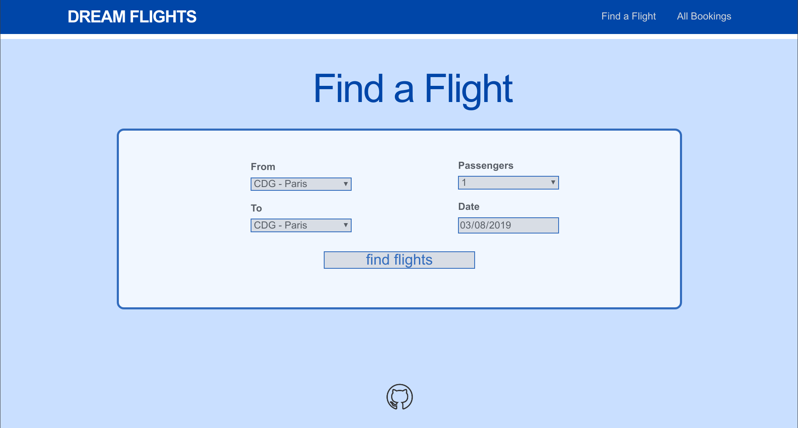
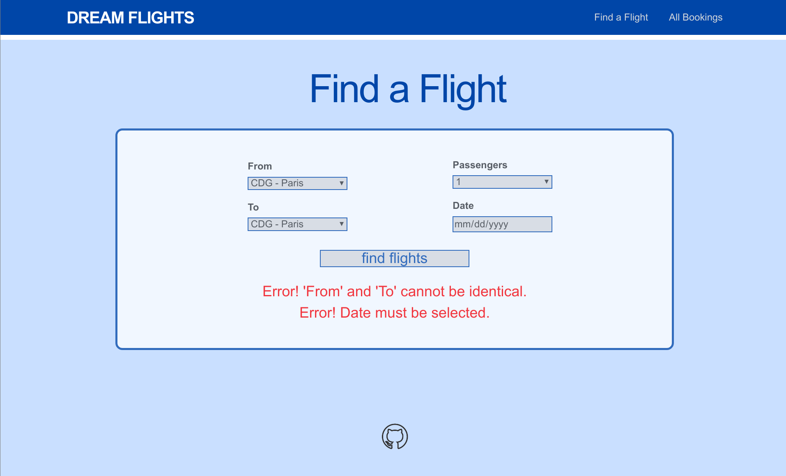
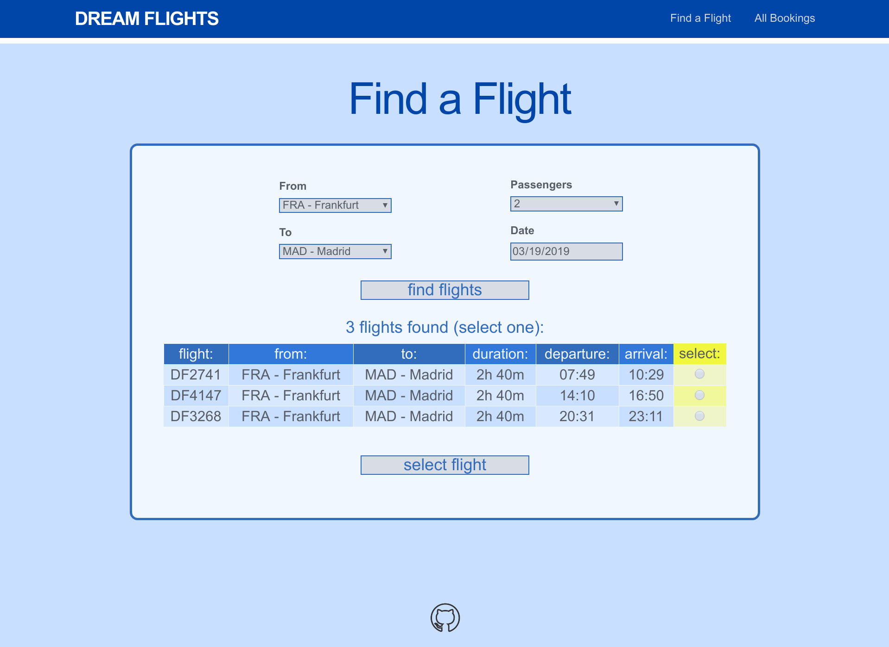
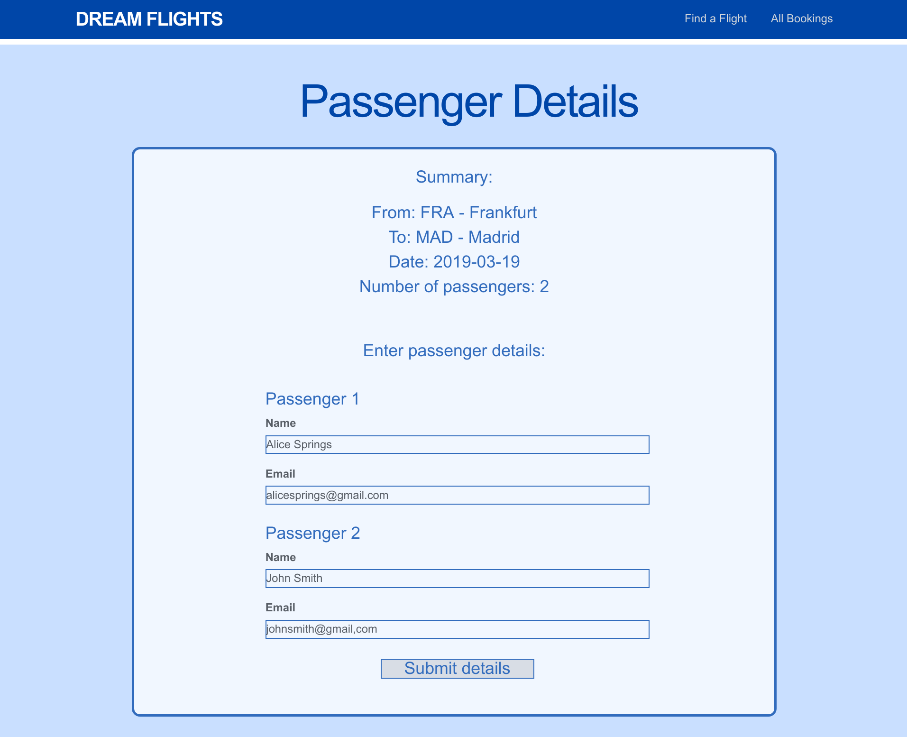
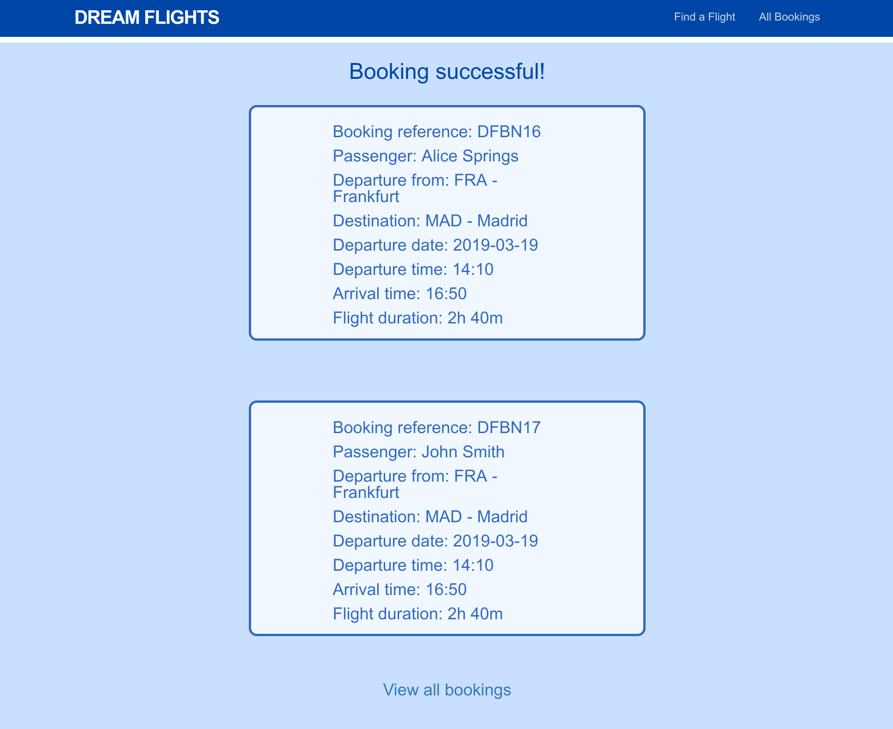
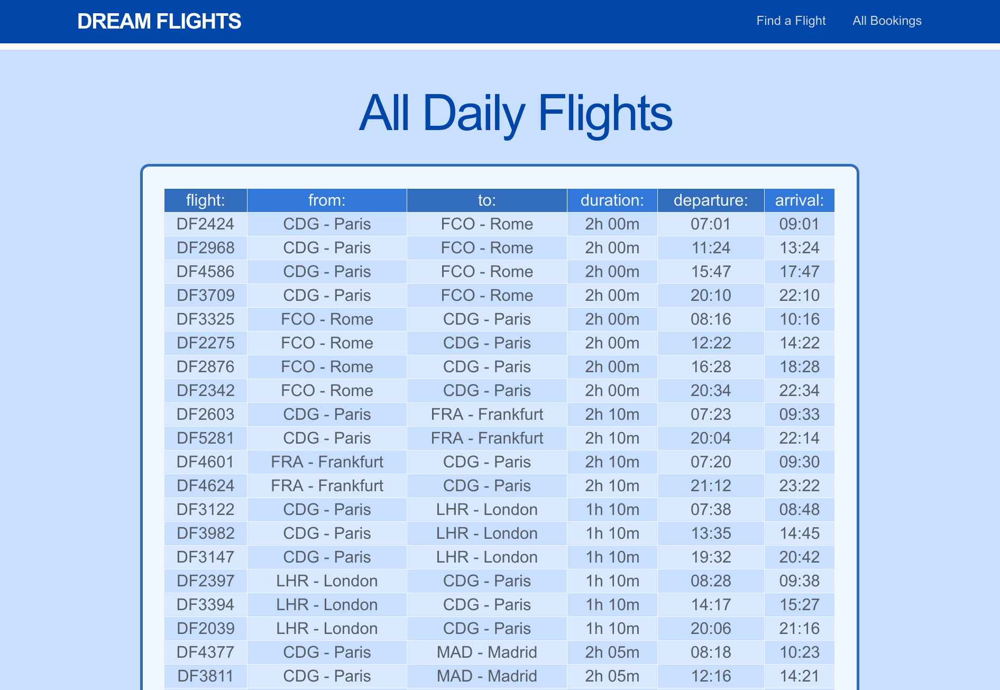

# README

Simon Tharby's solution to [Project: Building Advanced Forms](https://www.theodinproject.com/courses/ruby-on-rails/lessons/building-advanced-forms?ref=lnav), Advanced Forms and Active Record section, Ruby on Rails unit, Odin Project.

[View in browser](https://dream-flights-simontharby.herokuapp.com/) \*The server for this app may need to initialize and this may take up to 30 seconds.

## Divergence from Instructions:

I did not use a date object in the Flight model. Since the main focus of this exercise was to practice "...populating and building drop-down menus, radio buttons, and nested submissions...". I thought the instruction to create a table full of Flights with different dates was unwieldy, since this would involve creating Flights for ALL future dates a user may wish to travel on. In the real world, this would be logical, as flights may not be available every day, times may change, etc. For this demonstration, however, it seemed more logical to just assume all flights repeat daily, with the same details. Thus, I created data for Flights that represent flights that occur every day, and the 'date' included in a Booking can be any day in the future, therefore available flights will always exist for any future date.

## Screenshots:

App opens on 'Find a Flight' page (also root):



Example of form submission with errors in some fields:



Result of a valid 'Find a Flight' form submission:



Result of a valid 'Select Flight' form submission redirects to the 'Passengers' page:



A valid submission of the 'Passengers' form results in a successful booking, and redirects to the Bookings index page (to show the relevant bookings):



Flights index - Shows all daily flights:



## Getting started:

To get started with the app, clone the repo and then install the needed gems:

```
$ bundle install --without production
```

Next, migrate the database:

```
$ rails db:migrate
```

Run the app in a local server:

```
$ rails server
```
