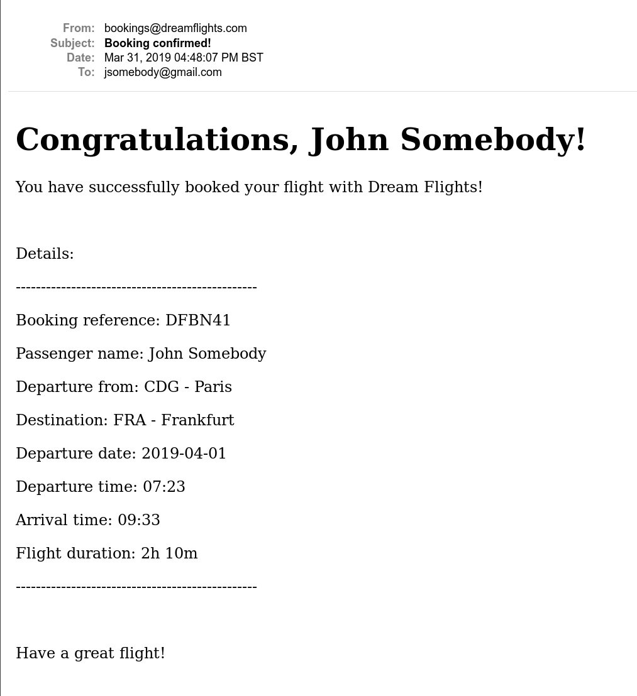
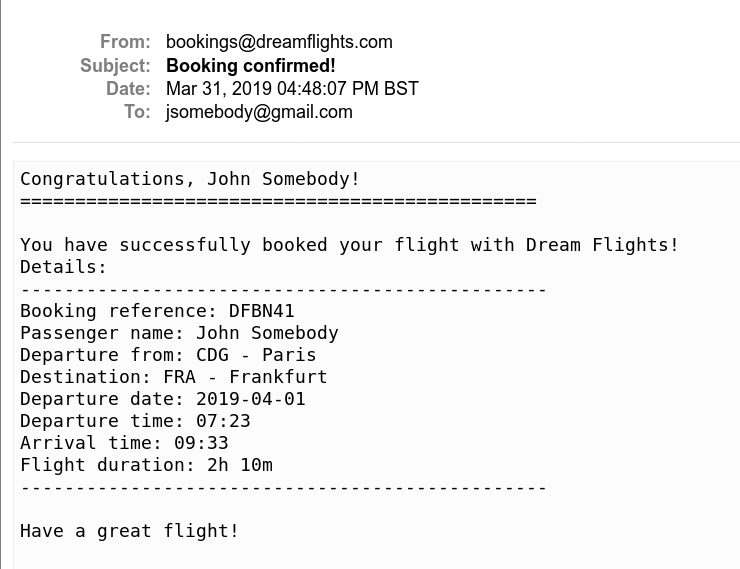

# README

Simon Tharby's solution to [Project: Sending Confirmation Emails](https://www.theodinproject.com/courses/ruby-on-rails/lessons/sending-confirmation-emails?ref=lnav), APIs, Mailers and Advanced Topics section, Ruby on Rails unit, Odin Project.

Note: This project adds to my [flight-booker app](https://github.com/jinjagit/flight-booker) (A.K.A. 'Dream Flights')

## Screenshots:

HTML email, sent by ActionMailer:



Text email, sent by ActionMailer:



## Getting started:

To get started with the app, clone the repo and then install the needed gems:

```
$ bundle install --without production
```

Next, migrate the database:

```
$ rails db:migrate
```

Run the app in a local server:

```
$ rails server
```
